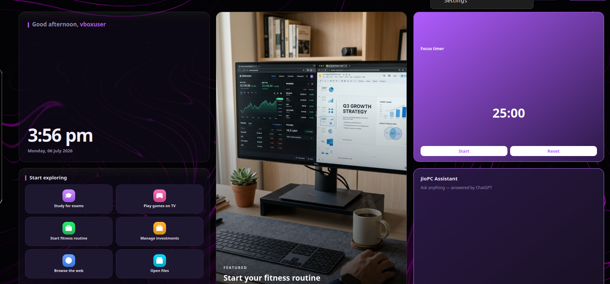

# JioPC Home

A single-process desktop shell for **Ubuntu 24.04 + LxQt**, built for JioPC
Hackathon 2026 — Challenge 01 ("Engaging Desktop Experience"). One
`QApplication`, no compositor, no GPU, no Electron: a dock, an application
menu, a plugin-based widget engine, a theme engine, and a first-run wizard,
all rendered on the CPU rasterizer inside a single Qt runtime.




[Demo video](screenshots/demo.webm)

## Components

| | Component | What it does |
|---|---|---|
| A | **Dock** | Left-edge dock with pin/unpin/reorder, running-window indicators via `python3-xlib` (event-driven, not polled), hover magnification, autohide |
| B | **Application Menu** | Fuzzy search, category filters, Recently/Most Used, and a usage-weighted Recommended section |
| C | **Widget Engine** | Snap-grid desktop widgets driven by a plugin ABC — 12 plugins ship today (carousel, news, quick-launch tiles, greeting/clock, calendar, focus timer, system health, music player, app shortcuts, digital wellbeing, assistant, plain clock); adding one is "add a file" |
| D | **Theme Engine** | Token-based light/dark themes rendered through one `QApplication.setStyleSheet()` call, with user accent/font overrides layered on top |
| E | **First-Run Wizard** | One-time onboarding: greeting, feature tour, initial theme/pin choices |

See [`design.md`](design.md) for the full architecture, technology
rationale, and known limitations behind each component.

## Measured against the challenge budget

| Constraint | Budget | Measured |
|---|---|---|
| Idle CPU | < 10% | 0.10% |
| Idle RSS | < 200 MB | 145.5 MB (1280x720) |
| Login-to-visible | < 3 s | 0.195 s p95 (first paint) / 0.621 s (packaged autostart) |

Full methodology and results: [`benchmarks/METHODOLOGY.md`](benchmarks/METHODOLOGY.md),
[`benchmarks/results/`](benchmarks/results/).

## Install

```bash
sudo apt install ./jiopc-home_0.1.0_all.deb
```

Full install/uninstall/build-from-source instructions: [`INSTALL.md`](INSTALL.md).

## Run from source (development)

```bash
sudo apt install -y python3-pyqt5 python3-xdg python3-xlib python3-requests papirus-icon-theme
python3 src/main.py
```

All persistent state lives under `~/.config/jiopc/home`,
`~/.local/share/jiopc/home`, and `~/.cache/jiopc/home` — nothing is written
elsewhere, and a session resumes identically on any machine sharing that
home directory.

## Project layout

```
src/
├── core/       qt_compat · paths · store · theme · x11 · colors · background · user · secrets
├── apps/       desktop_entries (scan .desktop) · launcher (QProcess) · usage (launch log)
├── dock/       Component A
├── menu/       Component B
├── widgets/    Component C — engine.py (plugin ABC + discovery) + plugins/
├── wizard/     Component E
└── settings/   theme + widget-arrange settings UI (Component D's user-facing surface)
benchmarks/     measure.sh, methodology, results
cms-mock/       mock CMS schema, sample feed, dev HTTP server
packaging/      .deb build scripts
scripts/        deployment/dev scripts
```

## Documentation

- [`design.md`](design.md) — architecture, technology choices, and known limitations
- [`INSTALL.md`](INSTALL.md) — install/uninstall/build steps
- [`cms-mock/SCHEMA.md`](cms-mock/SCHEMA.md) — the CMS content contract consumed by the widget engine
- [`benchmarks/METHODOLOGY.md`](benchmarks/METHODOLOGY.md) — how the idle CPU/RAM/startup numbers above were measured

## Verification

```bash
./scripts/deploy.sh          # deploy + launch in the target VM; logs at /tmp/jiopc.log
./benchmarks/measure.sh      # reproduce the idle CPU/RSS/startup numbers, 1280x720
./benchmarks/measure.sh 1920x1080   # cross-check at a larger resolution
```
